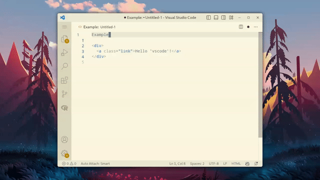

# vscode-html-escape

Escape and unescape selected HTML text in vscode.

Commands:

- `htmlEscape.escape` - will escape selected HTML text.
- `htmlEscape.unescape` - will unescape selected escaped HTML text.

